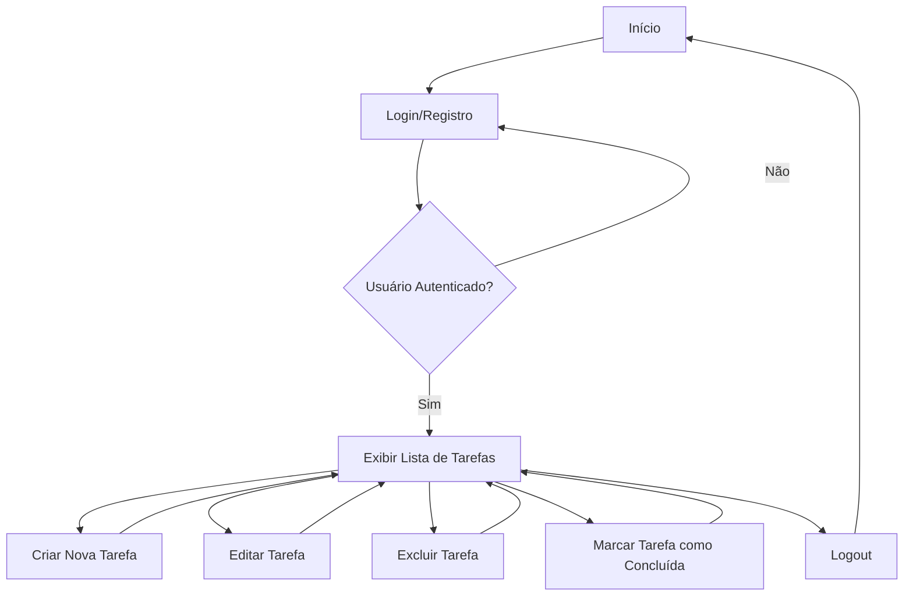

# Projeto To-Do List

## 1. O que Vamos Fazer
Desenvolver uma aplicação web de To-Do List que permitirá aos usuários criar, visualizar, editar e excluir tarefas. O projeto será desenvolvido utilizando Node.js no backend e React no frontend.

## 2. Escopo Funcional
### Funcionalidades Principais:
- **Criação de Tarefas:** O usuário poderá adicionar novas tarefas à lista.
- **Edição de Tarefas:** O usuário poderá editar as tarefas existentes.
- **Exclusão de Tarefas:** O usuário poderá remover tarefas da lista.
- **Marcar como Concluída:** O usuário poderá marcar as tarefas como concluídas.
- **Visualização de Tarefas:** O usuário poderá visualizar todas as tarefas em uma lista.
- **Filtro de Tarefas:** O usuário poderá filtrar tarefas por status (concluídas ou pendentes).

## 3. Escopo Não Funcional
### Qualidade e Desempenho:
- **Responsividade:** O sistema será responsivo e acessível em dispositivos móveis.
- **Performance:** O carregamento da aplicação deve ocorrer em menos de 3 segundos.
- **Segurança:** Implementação de boas práticas de segurança para proteger dados dos usuários.
- **Escalabilidade:** A arquitetura deve suportar a adição de novas funcionalidades no futuro sem grandes modificações na base existente.
- **Usabilidade:** Interface amigável e intuitiva, com foco na experiência do usuário.

## 4. Objetivos SMART
- **Específico:** Desenvolver uma To-Do List funcional com as funcionalidades básicas (criar, editar, excluir, visualizar e filtrar tarefas).
- **Mensurável:** A aplicação deve estar completamente funcional e acessível em até 3 meses.
- **Atingível:** O projeto será desenvolvido por uma equipe de 2 desenvolvedores usando Node.js e React.
- **Relevante:** A To-Do List é uma aplicação prática e amplamente utilizada, sendo útil tanto para usuários finais quanto como base para estudos e projetos maiores.
- **Temporal:** O projeto será concluído e entregue em 12 semanas a partir do início do desenvolvimento.

## 5. Cronograma
### Diagrama de Gantt

## 6. Análise de Risco
### Possíveis Riscos:
- **Atrasos no Cronograma:** A complexidade do frontend pode exigir mais tempo do que o planejado.
- **Problemas de Integração:** Incompatibilidades entre o frontend (React) e backend (Node.js).
- **Segurança:** Riscos de vulnerabilidades de segurança devido ao manuseio inadequado de dados.
- **Mudanças de Escopo:** Solicitações de novas funcionalidades que podem impactar o tempo de entrega.

### Mitigação:
- **Atrasos no Cronograma:** Realizar sprints semanais para monitoramento contínuo do progresso.
- **Problemas de Integração:** Testes contínuos de integração entre frontend e backend.
- **Segurança:** Implementar medidas de segurança desde o início, como validação de dados e uso de bibliotecas de segurança.
- **Mudanças de Escopo:** Definir claramente os requisitos desde o início e evitar mudanças durante o desenvolvimento.

## 7. Recursos
### Humanos:
- **Desenvolvedor Backend:** Focado no desenvolvimento do servidor e APIs em Node.js.
- **Desenvolvedor Frontend:** Responsável pela criação da interface em React.

### Tecnológicos:
- **Node.js:** Para o desenvolvimento do servidor.
- **React:** Para o desenvolvimento do frontend.
- **MongoDB:** Como banco de dados para armazenar as tarefas.
- **GitHub:** Para controle de versão e colaboração.
- **Heroku/AWS:** Para deploy da aplicação.

## 8. Observações
O escopo deste projeto deve ser mantido atualizado no repositório do GitHub, e qualquer alteração deve ser comunicada à equipe.

