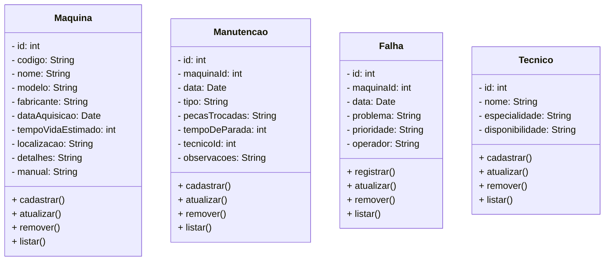

## 1. Objetivo do Projeto
Desenvolver um software para gerenciamento do ciclo de vida de máquinas e equipamentos industriais, visando a minimização do tempo de inatividade e a otimização da performance operacional.

## 2. Prazo
- **Duração total:** 1 semana
- **Data de início:** 07/10/2024
- **Data de término:** 12/10/2024

## 3. Funcionalidades Principais

1. **Cadastro de Máquinas e Equipamentos**
   - Interface para registro de máquinas e equipamentos.
   - Campos para descrição, localização, data de aquisição e especificações técnicas.

2. **Registro de Manutenções**
   - Módulo para registro de manutenções preventivas e corretivas.
   - Campos para data, tipo de manutenção, descrição da atividade realizada e responsável.

3. **Gerenciamento de Falhas**
   - Sistema para registrar e categorizar falhas.
   - Registro de data e hora da falha, descrição do problema e status de resolução.

4. **Gerenciamento de Técnicos**
   - Cadastro de técnicos de manutenção com informações de contato e especializações.
   - Atribuição de tarefas de manutenção aos técnicos.

5. **Relatórios e Indicadores de Desempenho**
   - Geração de relatórios personalizados sobre manutenções realizadas, falhas registradas e performance dos equipamentos.
   - Cálculo e exibição dos indicadores MTTR e MTBF.

6. **Notificações e Alertas**
   - Sistema de notificações para lembrar manutenções preventivas agendadas.
   - Alertas em caso de falhas recorrentes ou fora do padrão esperado.

## 4. Requisitos Técnicos

- **Tecnologia**
  - Linguagem de programação: Java
  - Integração com Java Server para criação de aplicações web.
  - Banco de dados: PostgreSQL
  
- **Segurança**
  - Controle de acesso baseado em perfis de usuário (administrador, técnico, etc.).
  - Backup automático dos dados.

## 5. Entregáveis

1. **Documentação do sistema:**
   - Especificações funcionais.
   - Manual do usuário.
   - Documentação técnica.

2. **Prototipagem:**
   - Protótipos de telas principais.
   - Demonstração da usabilidade do sistema.

3. **Sistema funcional:**
   - Versão beta do software, com funcionalidades principais implementadas e testadas.

## 6. Metodologia de Trabalho
- Abordagem ágil com reuniões diárias para acompanhamento do progresso.
- Iterações curtas para feedback contínuo.

## 7. Equipe do Projeto
- **Desenvolvedor:** Christopher, Digogo

## 8. Riscos e Mitigações
- **Risco:** Atrasos no desenvolvimento devido a mudanças de escopo.
  - **Mitigação:** Definir claramente as funcionalidades e evitar mudanças durante o desenvolvimento.
  
- **Risco:** Falta de comunicação durante o desenvolvimento.
  - **Mitigação:** Reuniões diárias para alinhamento e feedback.

## 9. Avaliação e Ajustes
- Testes de funcionalidade e usabilidade realizados ao longo da semana.
- Coleta de feedback para ajustes antes da entrega final.

Risco: Atrasos no desenvolvimento devido a mudanças de escopo.
Mitigação: Definir claramente as funcionalidades e evitar mudanças durante o desenvolvimento.
Risco: Falta de comunicação durante o desenvolvimento.
Mitigação: Reuniões diárias para alinhamento e feedback.
9. Avaliação e Ajustes

Testes de funcionalidade e usabilidade realizados ao longo da semana.
Coleta de feedback para ajustes antes da entrega final.

# Diagrama de Classes

